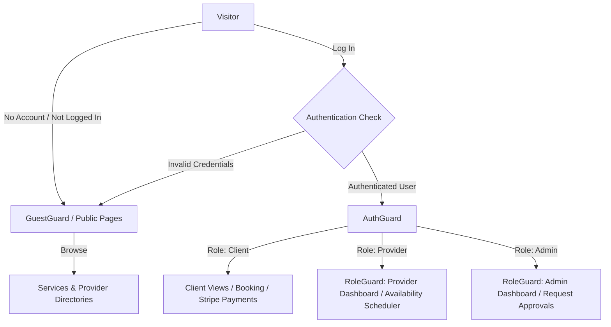

# 📅 Booking Restructuring

A premium, modern, multi-role booking management web application built with **Next.js 16 (App Router)**, **React 19**, **TypeScript**, **Tailwind CSS 4**, and **TanStack React Query v5**.

The application is structured around a decoupled, feature-based modular design that organizes authentication, providers, services, availability scheduling, payments, and notifications into highly cohesive, domain-driven modules.

---

## 🚀 Key Features & Capabilities

This platform supports a comprehensive service booking lifecycle with distinct user roles:

### 👤 Guest / Public Access
* **Interactive Landing Page:** Modern hero section, verified feature grids, onboarding workflows, and dynamic call-to-actions.
* **Role Selection Onboarding:** Clear signup funnels for clients and service providers.
* **Provider & Service Directories:** Public search, detail views, and reviews.

### 🛍️ Client Portal
* **Browse Categories:** Explore over 50+ service categories with structured search.
* **Booking Creation:** Select from available provider time slots and schedule appointments.
* **Secure Payments:** Integrated checkout flows powered by **Stripe** with instant payment confirmation.
* **Booking Dashboard:** View, track, and manage all past and upcoming service appointments.

### 💼 Provider Portal
* **Onboarding & Verification:** Standard registration and profile approval process.
* **Service Management:** Add, configure, and maintain individual service catalog offerings.
* **Availability Scheduler:** Configure weekly schedules and specific time slots.
* **Provider Dashboard:** Track service requests, view statistics, and manage incoming bookings.

### 🛡️ Administrator Portal
* **Request Processing:** Review and approve pending provider verification requests.
* **Administrative Tables:** Unified list controls for **Users**, **Providers**, and **Services**.
* **Global Actions:** Password reset control, account management, and content moderation.

---

## 📐 Access Control & Navigation Flow

The following diagram illustrates how user roles are authenticated and routed to their respective dashboards:



---

## 🛠️ Tech Stack & Core Dependencies

### Frontend Core
* **Next.js 16 (App Router):** Leverages server-side data pre-fetching, dynamic route layouts, and search engine optimization.
* **React 19:** Utilizing the latest Concurrent features and performance improvements.
* **TypeScript:** Robust static typing across DTOs, API contracts, and React components.
* **Tailwind CSS 4:** Ultra-modern responsive design with modern utility systems.
* **Base UI & Radix UI:** Accessible component primitives for menus, modals, select boxes, and dialogs.

### State & Integration
* **TanStack React Query v5:** Server-state management, automated query caching, invalidation, and mutation flows.
* **Axios (with interceptors):** Centralized HTTP client configured with cookie session transport (`withCredentials: true`).
* **Stripe SDK:** Form widgets and checkout validation logic.
* **React Hook Form & Zod:** Type-safe form validation for credential handling and data editing.
* **React Toastify:** Interactive push notifications and service status alerts.

---

## 📂 Project Structure

```text
booking_restructuring/
├── app/                      # Next.js App Router root
│   ├── (pages)/              # Structured Route Groups (unaffected URL paths)
│   │   ├── (auth)/           # Authentication routes (login, register)
│   │   ├── (user)/           # User profile management (profile, update-info)
│   │   ├── admin-dashboard/  # Admin analytics & approval control panel
│   │   ├── provider-dashboard/# Provider scheduling & service listings
│   │   ├── booking/          # Client booking request & history
│   │   ├── providers/        # Public provider lists & directory
│   │   └── services/         # Public service directories
│   ├── _components/          # Shared components (headers, dialogs, buttons)
│   ├── _modules/             # Domain-Driven Feature Modules
│   │   ├── auth/             # Sign-in hook wrappers, validations, custom UI
│   │   ├── users/            # Profile states, DTOs, password mutation
│   │   ├── providers/        # Provider hooks, repositories, views
│   │   ├── services/         # Services CRUD & hook implementations
│   │   ├── availability/     # Shift-times table, calendar, slot generation
│   │   ├── booking/          # Booking details, cancel buttons, mutations
│   │   ├── payment/          # Stripe billing forms & validation
│   │   ├── notifications/    # Message hooks, toast indicators, alert boxes
│   │   └── guards/           # Client-side routing protections (Auth, Guest, Role)
│   ├── globals.css           # Tailwind custom imports and root theme colors
│   └── layout.tsx            # Main layout importing React Query & Toast providers
├── components/               # Design System primitives
│   ├── ui/                   # Reusable atomic UI (Avatar, Button, Card, Tabs, etc.)
│   └── theme-provider.tsx    # Light/Dark theme configuration wrapper
├── Providers/                # Next.js Server/Client Provider Wrappers
│   ├── react-query-provider.tsx # TanStack query instantiation
│   └── toast-provider.tsx    # React Toastify initialization
├── lib/                      # Standard utility helper layer (e.g. cn class merger)
└── utils/                    # Network & Constant Configurations
    ├── axiosInstance.ts      # Configured Axios instance with interceptors
    └── constance.ts          # Endpoint hosts and Query Key constants
```

---

## ⚙️ Environment Configuration

The application interfaces with a backend API using `utils/axiosInstance.ts` and `utils/constance.ts`. Create a `.env` or `.env.local` file in the root directory:

| Environment Variable | Description | Example / Default Value |
| :--- | :--- | :--- |
| `NEXT_PUBLIC_API_URL` | Backend REST API host url | `http://localhost:5000` |
| `NEXT_PUBLIC_STRIPE_PUBLISHABLE_KEY` | Public Stripe test credentials | `pk_test_...` |
| `NEXT_PUBLIC_STRIPE_SECREAT_KEY` | Secret Stripe credential token | `sk_test_...` |

---

## 🚀 Quick Start Guide

Follow these steps to run the application locally:

### 1. Prerequisites
Ensure you have the following installed:
* **Node.js** (v18.x or newer recommended)
* **pnpm** (preferred package manager)

### 2. Install Dependencies
Run the following command at the root of the project to download all necessary packages:
```bash
pnpm install
```

### 3. Verify Env Variables
Make sure your `.env` file exists and contains the correct API and Stripe keys as shown in the Environment Configuration section.

### 4. Start Development Server
Boot up the local web server:
```bash
pnpm dev
```
Open **[http://localhost:3000](http://localhost:3000)** in your browser.

---

## 🛠️ Build & Deployment

### Production Compilation
Optimize files and bundle assets for production:
```bash
pnpm build
```

### Run Production Server
Serve the compiled Next.js build locally:
```bash
pnpm start
```

### Code Style & Lints
Validate TypeScript syntax and code format consistency:
```bash
pnpm lint
```

---

## 🧩 Architecture & Design Patterns

### 1. Decoupled Domain Modules (`app/_modules/`)
Instead of nesting logic inside page routes, this project groups features by context under `app/_modules/`. Each module typically consists of:
* **`entity/`**: Types and interfaces representation.
* **`dto/`**: Data Transfer Objects for network payloads.
* **`repo/`**: Network request layer (fetching, API routes call).
* **`hooks/`**: Custom TanStack Query integrations (mutations, query hooks).
* **`views/`**: Internal/reusable UI blocks specific to that feature set.

This pattern isolates page routes (which are thin wrappers fetching or mounting views) from the underlying domain logic, making refactoring or styling changes extremely straightforward.

### 2. Multi-tier Route Protection
Client-side routes are protected by components inside `app/_modules/guards`:
* **`AuthGuard`**: Redirects unauthenticated users to `/login`.
* **`GuestGuard`**: Restricts authenticated users from viewing sign-in/sign-up forms.
* **`RoleGuard`**: Ensures only users with the correct role (e.g. `provider` or `admin`) can access administrative modules.

### 3. Unified Theme Configuration
Theme switching is supported via `next-themes` and a customized `ThemeProvider` loaded in the root layout. Interactive dark/light mode toggle can be found at `components/ui/mode-toggle-btn.tsx`.
